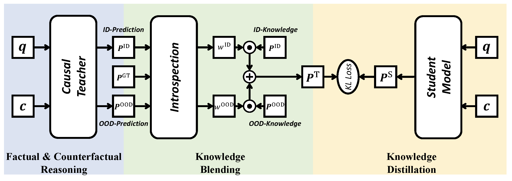

# Introspective Distillation for Robust Question Answering

This repository is the Pytorch implementation of our paper [" Introspective Distillation for Robust Question Answering"](https://arxiv.org/abs/2111.01026) in NeurIPS 2021.

IntroD is proposed to achieve both high in-distribution (ID) and out-of-distribution (OOD) performances for question answering tasks like VQA and extractive QA. The key technical contribution is to blend the inductive bias of OOD and ID by introspecting whether a training sample fits in the factual ID world or the counterfactual OOD one.

<p align="center">
    
</p>

<p align="center">
    
</p>


If you find this paper and codes help your research, please kindly consider citing our papers in your publications.
```
@inproceedings{niu2021introspective,
  title={Introspective Distillation for Robust Question Answering},
  author={Niu, Yulei and Zhang, Hanwang},
  booktitle={Thirty-Fifth Conference on Neural Information Processing Systems},
  year={2021}
}
```
```
@inproceedings{niu2020counterfactual,
  title={Counterfactual VQA: A Cause-Effect Look at Language Bias},
  author={Niu, Yulei and Tang, Kaihua and Zhang, Hanwang and Lu, Zhiwu and Hua, Xian-Sheng and Wen, Ji-Rong},
  booktitle={Proceedings of the IEEE/CVF Conference on Computer Vision and Pattern Recognition},
  year={2021}
}
```